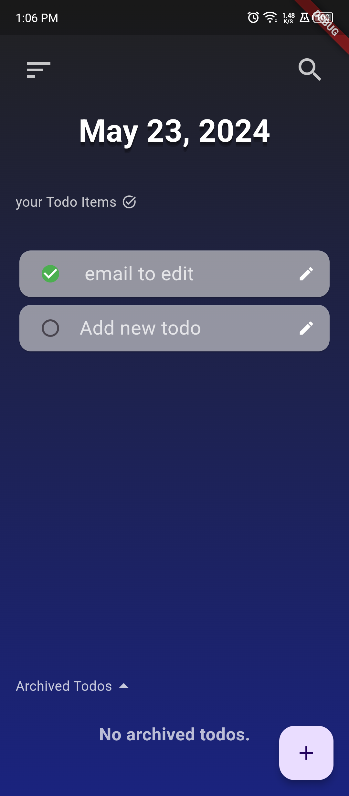
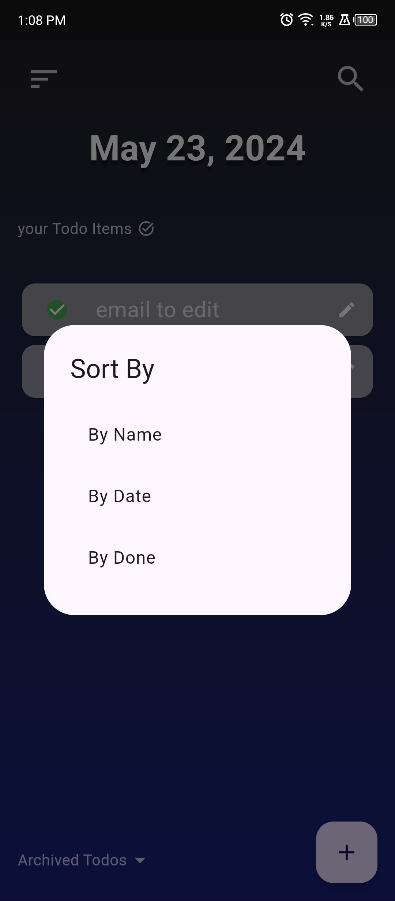
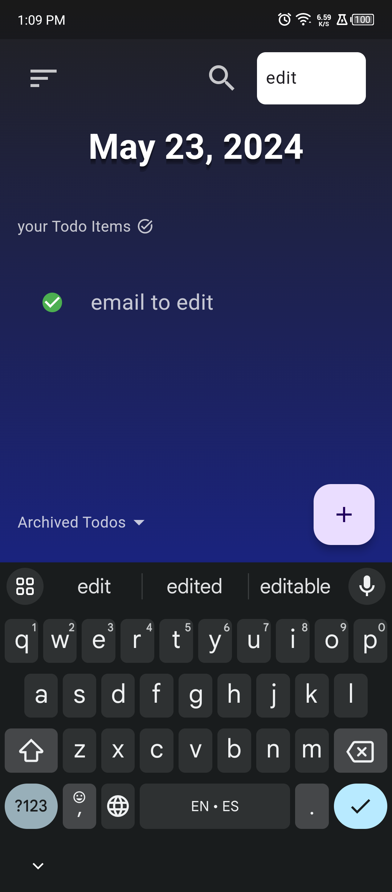
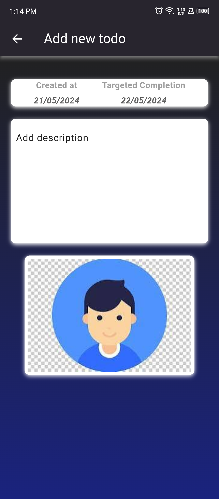
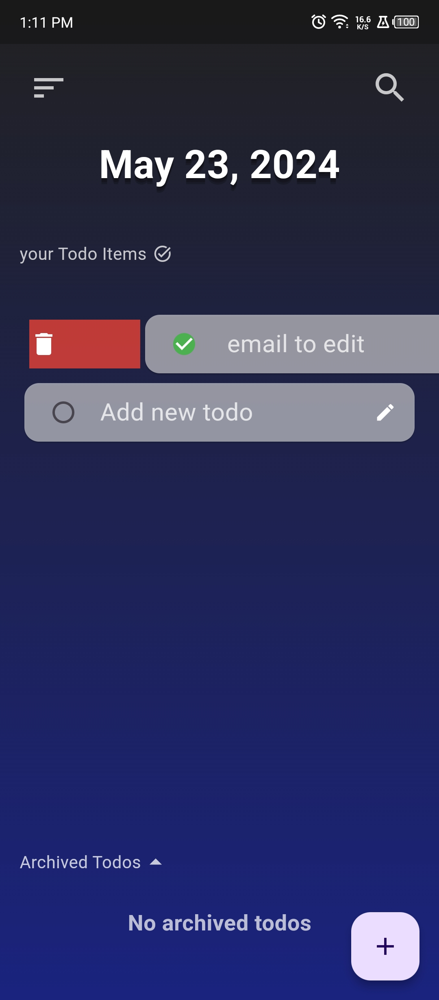
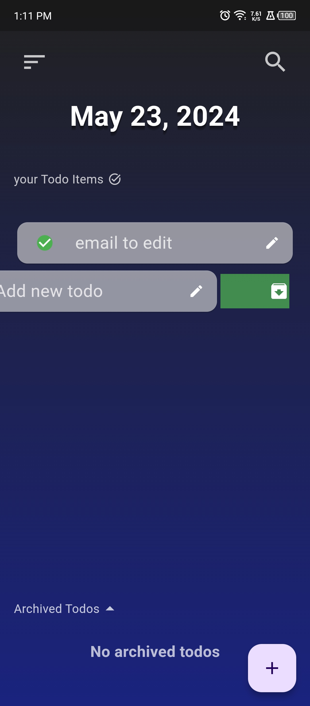

# Todo App

## Screenshots

<table>
    <thead>
        <tr>
            <td>Homepage</td>
<td>Sort Feature</td>
<td>Search Feature</td>
        </tr>
    </thead>
  <tr>
    <td></td>
    <td></td>
    <td></td>
  </tr>
<thead>
        <tr>
            <td>Description</td>
<td>Delete</td>
<td>Archive</td>
        </tr>
    </thead>
  <tr>
    <td></td>
    <td></td>
    <td></td>
  </tr>
</table>

## Features

- Feature 1
- Feature 2
- Feature 3
  not existed in details section in database upgrade